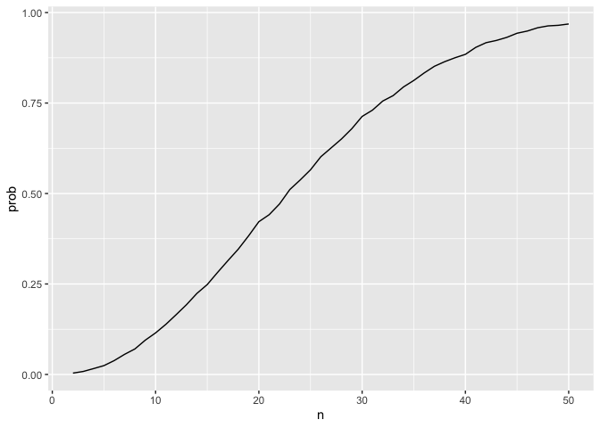
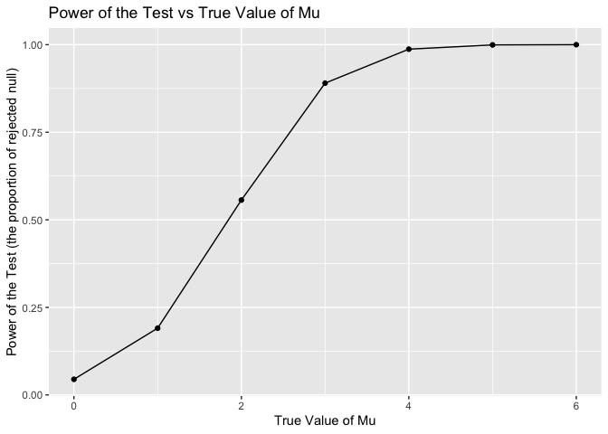
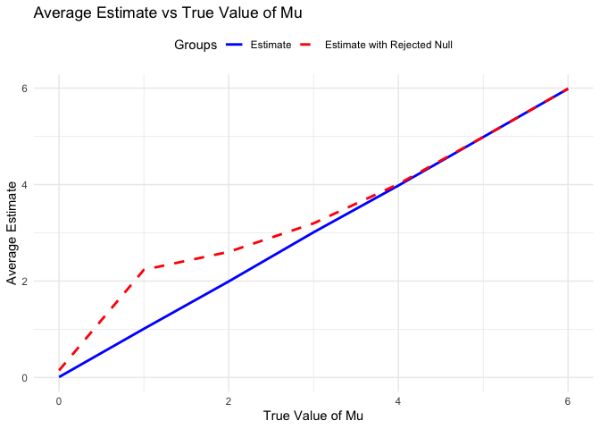
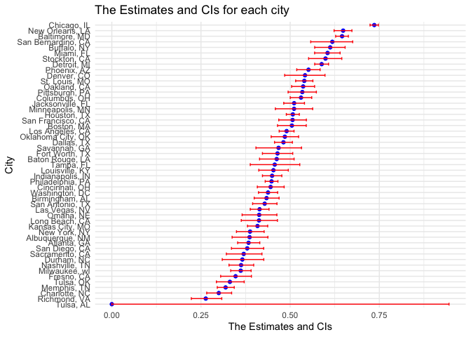

p8105_hw5_yc4617
================
2024-11-14

``` r
# necessary library
library(tidyverse)
```

    ## ── Attaching core tidyverse packages ──────────────────────── tidyverse 2.0.0 ──
    ## ✔ dplyr     1.1.4     ✔ readr     2.1.5
    ## ✔ forcats   1.0.0     ✔ stringr   1.5.1
    ## ✔ ggplot2   3.5.1     ✔ tibble    3.2.1
    ## ✔ lubridate 1.9.3     ✔ tidyr     1.3.1
    ## ✔ purrr     1.0.2     
    ## ── Conflicts ────────────────────────────────────────── tidyverse_conflicts() ──
    ## ✖ dplyr::filter() masks stats::filter()
    ## ✖ dplyr::lag()    masks stats::lag()
    ## ℹ Use the conflicted package (<http://conflicted.r-lib.org/>) to force all conflicts to become errors

``` r
library(dplyr)
library(tidyr)
# library(purrr)
library(broom)
```

# Problem 1:

``` r
# write the function
bday_sim = function(n){
  bdays = sample(1:365, size =n, replace = TRUE)
  duplicate = length(unique(bdays)) < n
  return(duplicate)
}
bday_sim(10)
```

    ## [1] FALSE

``` r
# from 2-50
sim_res = 
  expand_grid(
    n = 2:50,
    iter = 1:10000
  )|>
  mutate(res = map_lgl(n, bday_sim)) |>
  group_by(n)|>
  summarize(prob = mean(res))

# make the plot
sim_res |>
  ggplot(aes(x = n, y = prob)) +
  geom_line()
```

<!-- -->

# Problem 2:

``` r
# set default
n = 30 
sigma = 5
mu_list = 0:6
iter = 5000
alpha = 0.05
set.seed(123)
power_df = data.frame()
estimate_df = data.frame()
```

``` r
# generate 5000 datasets from the model
for (mu in mu_list) {

  p_values <- numeric(iter)
  estimates <- numeric(iter)
  
  for (i in 1:iter) {
    data <- rnorm(n, mean=mu, sd=sigma)
    test <- t.test(data, mu=0)
    tidy_test <- broom::tidy(test)  
    p_values[i] <- tidy_test$p.value       
    estimates[i] <- tidy_test$estimate    
  }
  
  # Calculate power 
  power <- mean(p_values < alpha)
  
  # Store power and average estimate
  power_df <- rbind(power_df, data.frame(mu=mu, power=power))
  estimate_df <- rbind(estimate_df, data.frame(
    mu=mu, avg_estimate=mean(estimates), avg_estimate_reject=mean(estimates[p_values < alpha])
  ))
}
```

``` r
# plot
# Plot 1: Power vs True mu
ggplot(power_df, aes(x=mu, y=power)) +
  geom_line() +
  geom_point() +
  labs(title="Power of the Test vs True Value of Mu",
       x="True Value of Mu",
       y="Power of the Test (the proportion of rejected null)")
```

<!-- -->
When the true mean of mu is close to 0, the power of the test is low.
This means the test is less likely to detect a difference from the null
hypothesis. As mu increases to values like 2 or 3, power increases
significantly. When the true mean mu reaches higher values (around 4 and
above), the power of the test approaches 1.0, meaning it almost always
correctly rejects the null hypothesis when it is false.

``` r
# Plot 2: Average Estimate vs True mu
ggplot(estimate_df, aes(x=mu)) +
  geom_line(aes(y=avg_estimate, color="Estimate"), linetype="solid", size=1) +
  geom_line(aes(y=avg_estimate_reject, color="Estimate with Rejected Null"), linetype="dashed", size=1) +
  labs(title="Average Estimate vs True Value of Mu",
       x="True Value of Mu",
       y="Average Estimate") +
  theme_minimal() +
  scale_color_manual(name="Groups",values=c("Estimate"="blue", "Estimate with Rejected Null"="red")) +
  theme(legend.position="top")
```

    ## Warning: Using `size` aesthetic for lines was deprecated in ggplot2 3.4.0.
    ## ℹ Please use `linewidth` instead.
    ## This warning is displayed once every 8 hours.
    ## Call `lifecycle::last_lifecycle_warnings()` to see where this warning was
    ## generated.

<!-- -->
When the true value of mu is small (close to 0), the red dashed line
(representing the average estimate when the null hypothesis is rejected)
is noticeably above the blue line (representing the overall average
estimate) and the actual true mu values. Because when the null
hypothesis is rejected at small effect sizes, it typically means that
the observed sample mean mu was larger than expected by chance. As mu
increases, the red dashed line converges with the blue line, indicating
that the average estimate of mu (when the null is rejected) aligns more
closely with the true value of mu. Because the test at larger effect
sizes has higher power, it’s more likely to detect the true mean without
as much selection bias.

# Problem 3:

``` r
homicide_data = read.csv("homicide-data.csv")
```

For the raw homicide data, there are 52179 rows and 12 columns with the
these variables: uid, reported_date, victim_last, victim_first,
victim_race, victim_age, victim_sex, city, state, lat, lon, disposition

``` r
homicide_summary =  homicide_data%>%
  mutate(city_state = paste(city, state, sep = ", ")) %>%
  group_by(city_state) %>%
  summarize(
    total_homicides = n(),
    unsolved_homicides = sum(disposition %in% c("Closed without arrest", "Open/No arrest"))
  )
```

``` r
# run for baltimore
baltimore_data = homicide_summary %>%
  filter(city_state == "Baltimore, MD")

baltimore_test <- prop.test(baltimore_data$unsolved_homicides, baltimore_data$total_homicides)


baltimore_results <- broom::tidy(baltimore_test)%>%
  select(estimate, conf.low, conf.high)
baltimore_results
```

    ## # A tibble: 1 × 3
    ##   estimate conf.low conf.high
    ##      <dbl>    <dbl>     <dbl>
    ## 1    0.646    0.628     0.663

``` r
# run for each cities
city_results <- homicide_summary %>%
  mutate(
    test_results = purrr::map2(unsolved_homicides, total_homicides, ~ prop.test(.x, .y) %>% tidy())
  ) %>%
  unnest(test_results) %>%
  select(city_state, estimate, conf.low, conf.high)
city_results
```

    ## # A tibble: 51 × 4
    ##    city_state      estimate conf.low conf.high
    ##    <chr>              <dbl>    <dbl>     <dbl>
    ##  1 Albuquerque, NM    0.386    0.337     0.438
    ##  2 Atlanta, GA        0.383    0.353     0.415
    ##  3 Baltimore, MD      0.646    0.628     0.663
    ##  4 Baton Rouge, LA    0.462    0.414     0.511
    ##  5 Birmingham, AL     0.434    0.399     0.469
    ##  6 Boston, MA         0.505    0.465     0.545
    ##  7 Buffalo, NY        0.612    0.569     0.654
    ##  8 Charlotte, NC      0.300    0.266     0.336
    ##  9 Chicago, IL        0.736    0.724     0.747
    ## 10 Cincinnati, OH     0.445    0.408     0.483
    ## # ℹ 41 more rows

``` r
# plot
ggplot(city_results, aes(x = reorder(city_state, estimate), y = estimate)) +
  geom_point(color = "blue") +
  geom_errorbar(aes(ymin = conf.low, ymax = conf.high),width = 0.5, color = "red") +
  labs(
    title = "The Estimates and CIs for each city",
    x = "City",
    y = "The Estimates and CIs"
  ) +
  coord_flip() +
  theme_minimal()
```

<!-- --> I
notice the werid data about Tulsa, AL. The data shows only one case in
Tulsa, AL and it’s unsolved although Google website shows Tulsa is in OK
rather than AL state. So its estimate is 0 and CI is from 0 to 1.
